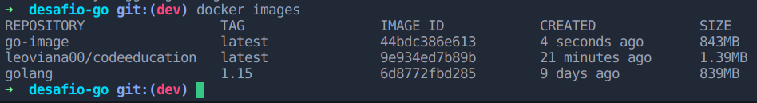
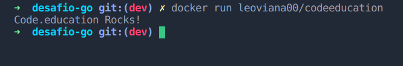

# Projeto prtático: Otimização de uma imagem golang

## 🌱 Descrição do projeto 

Esse desafio é muito empolgante principalmente se você nunca trabalhou com a linguagem Go!
Você terá que publicar uma imagem no docker hub. Quando executarmos:

    -  docker run <seu-user>/codeeducation

Temos que ter o seguinte resultado: `Code.education Rocks!`

Se você perceber, essa imagem apenas realiza um print da mensagem como resultado final, logo, vale a pena dar uma conferida no próprio site da Go Lang para aprender como fazer um "olá mundo".

Lembrando que a Go Lang possui imagens oficiais prontas, vale a pena consultar o Docker Hub.

A imagem de nosso projeto Go precisa ter menos de 2MB =)

Dica: No vídeo de introdução sobre o Docker quando falamos sobre o sistema de arquivos em camadas, apresento uma imagem "raiz", talvez seja uma boa utilizá-la.

Divirta-se

## Utilizando o multi-stage build para compilar a aplicação e otimizar a imagem

```
# satage 1
# Dockerizando o app
FROM golang:alpine AS builder

# criando um diretório de trabalho
WORKDIR /src

# Copiando o app
COPY . .

# Compilação
# script de construção para compilar estaticamente nosso aplicativo com todas as bibliotecas integradas
RUN go build -ldflags '-s -w' main.go

# stage 2
# Add o scratch
FROM scratch

# diretório de trabalho
WORKDIR /

# copiando o binário
COPY --from=builder /src / 

# executando 
CMD ["./main"]
```

## Build 

```
docker build -t leoviana00/codeeducation . -f Dockerfile.scratch
```

## Images
```
docker images
```


## Run

```
docker run leoviana00/codeeducation
```


## Docker login

```
docker login
```
## Push

```
docker pull leoviana00/codeeducation
```
## Pull

```
docker pull leoviana00/codeeducation
```
